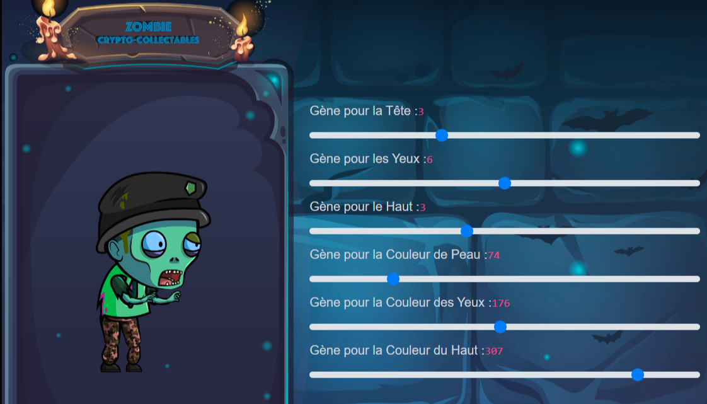

https://serbelloni.vercel.app
  <!--  -->

      <section id="work" class="portfolio-mf sect-pt4 route">
      

        

          

            

              <h3 class="title-a">
                Portfolio
              </h3>
              

              

              

            

          

        

      

        

          

            <a href="assets/img/portfoli_biblio.png" data-gallery="portfolioGallery" class="portfolio-lightbox">
              

                
              

            </a>
            

              

                

                  <h2 class="w-title">Bibliothèque en ligne</h2>
                  

                    Web Design / Mars 2023
                  

                

                

                  

                    
                  

                

              

            

          

        

        <!-- Fenêtre modale -->
        

          

            &times;
            <h2>Bibliothèque en ligne</h2>
            
Ce site est conçu pour mettre en valeur mes compétences en développement. Il est <b> important de noter </b> que les informations 
              contenues dans le site ne sont pas nécessairement réelles, mais plutôt utilisées à des fins démonstratives.

            

              <a href="https://serbelloni.alwaysdata.net/?controller=home&action=home" target="_blank" class="link_site">Site internet</a>
            <!-- <a href="https://github.com/Srblx" class="link_code_source" target="_blank">Code source</a> -->
          

          

        

      
        

          

            <a href="assets/img/portfolio_miramas.png" data-gallery="portfolioGallery" class="portfolio-lightbox">
              

                
              

            </a>
            

              

                

                  <h2 class="w-title">Les amis du vieux Miramas</h2>
                  

                    Web Design / Avril 2023
                  

                

                

                  

                    
                  

                

              

            

          

        

        <!-- Fenêtre modale -->
        

          

            &times;
            <h2>Les amis du vieux Miramas</h2>
            
Site en cour de déploiment dans sa version HTTPS

            <a href="https://amisduvieuxmiramas.fr" target="_blank" class="link_site">Site internet</a>
          

        

        

          

            <a href="assets/img/work-3.jpg" data-gallery="portfolioGallery" class="portfolio-lightbox">
              

                
              

            </a>
            

              

                

                  <h2 class="w-title">PortFolio Personnel</h2>
                  

                    Web Design / Avril 2023
                  

                

                

                  

                    <a href="#"> </a>
                  

                

              

            

          

        

        

          

            <a href="assets/img/bytemaster.png" data-gallery="portfolioGallery" class="portfolio-lightbox">
              

                
              

            </a>
            

              

                

                  <h2 class="w-title">Les amis du vieux Miramas</h2>
                  

                    Web Design / Avril 2023
                  

                

                

                  

                    
                  

                

              

            

          

        

        <!-- Fenêtre modale -->
        

          

            &times;
            <h2>ByteMaster</h2>
            
Ce site constitue une plateforme interactive et dynamique offrant une variété de quiz à différents niveaux portant sur les langages de programmation les plus couramment utilisés.

            <a href="https://bytemaster.alwaysdata.net" target="_blank" class="link_site">Site internet</a>
          

        

        

          

            <a href="assets/img/attribu_zombie.png" data-gallery="portfolioGallery" class="portfolio-lightbox">
              

                
              

            </a>
            

              

                

                  <h2 class="w-title">Usine à Crypto Zombie</h2>
                  

                    Smart Contract / Avril 2023
                  

                

                

                  

                    
                  

                

              

            

          

        

        <!-- Fenêtre modale -->
        

          

            &times;
            <h2>Usine Crypto Zombie</h2>
            
Dans le souci de garantir une expérience fluide et accessible à tous les joueurs, j'ai choisi de ne pas déployer le Smart Contract sur la blockchain publique en raison des frais associés aux transactions. Cependant, vous pouvez consulter le code source sur GitHub pour découvrir les mécanismes sous-jacents et les fonctionnalités passionnantes du jeu.

            <a href="https://github.com/Srblx/CryptoZombie" target="_blank" class="link_code_source">Code source</a>
          

        

        